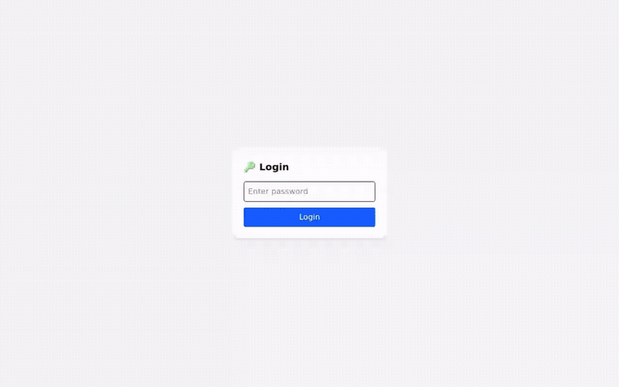

# Annotate-easy

Model-assisted image annotation for custom objects that no pretrained detector knows about.

Open an image and a detector proposes the objects it finds. Each proposal gets refined
into a pixel-accurate polygon by SAM, so most of the work is correcting proposals
instead of drawing masks from scratch.

Point it at your own trained weights and it proposes your classes instead of COCO's 80.
No code changes needed.



**Contents:** [Why this exists](#why-this-exists) · [What it does](#what-it-does) ·
[Quick start](#quick-start) · [Usage](#usage) ·
[Using your own detector](#using-your-own-detector) ·
[Configuration](#configuration) · [Data handling](#data-handling) ·
[Limitations](#limitations) · [Notes on model choice](#notes-on-model-choice) ·
[Stack](#stack) · [License](#license)

---

## Why this exists

I needed to label about 6000 images of a custom object for a production detection
model. No pretrained detector had ever seen the object, so every mask would have been
drawn by hand. That's several weeks of work.

Here's the approach that actually worked:

1. Render synthetic data with a render engine, which gives you images of the object
   with perfect, free annotations.
2. Train a model on the synthetic data only. It doesn't transfer cleanly to real
   images; this is the sim2real domain gap, and it's well documented.
3. Don't bother closing the gap. Instead of spending effort on domain adaptation or
   style transfer to make the synthetic model accurate, use it as a proposal engine.
   It just needs to be close enough that correcting it is cheaper than drawing from
   scratch.
4. Refine the boundaries with SAM. The synthetic model gives rough boxes; SAM turns
   each into a tight polygon. Placing the box and getting a precise edge are different
   problems, so it uses a different model for each one.
5. A human corrects: delete false positives, fix labels, click-add whatever got
   missed.
6. Retrain on the corrected real labels and use those weights to propose on the next
   batch.

Roughly 2000 images were labeled with synthetic-model assistance to bootstrap the
process, and the remaining ~4000 used the retrained real-data weights, which proposed
noticeably better. Dataset preparation time came down about 40% on that dataset.

That number comes from an earlier desktop tool I built for the same project, a
different codebase working on that one dataset. It's what motivated building
Annotate-easy to generalize the workflow into something reusable. It isn't a
measurement of this repo, which I haven't benchmarked yet.

On prior art: none of these pieces are new by themselves. Model-assisted labeling
already ships in Roboflow, CVAT, and Label Studio, and sim2real is its own large
research field. What's a little different here is choosing not to close the domain
gap. Most sim2real work tries to make the synthetic model deployable, which is
expensive; treating the gap as a correction cost instead of a problem to solve is what
made this workable on a small budget.

---

## What it does

- **Base run** — on first open, the configured detector proposes objects and SAM
  refines each into a polygon. The image arrives pre-annotated.
- **Point-click segmentation** — click an object, get a mask. Multiple points for
  large or complex objects.
- **Edit mode** — drag vertices, relabel, delete, undo/redo.
- **Folder browsing** — load a directory, step through with Prev/Next. Annotations for
  each image are cached as you move around, and auto-saved to the browser's local
  storage, so a refresh or a closed tab doesn't lose them. Re-select the same folder
  later and it picks up where you left off instead of re-running the base model.
- **Export** — JSON or COCO for the open image, or **Save All** for the whole
  folder as a zip: one JSON per image, filename matching the image (`img1.jpg` →
  `img1.json`) — the paired-file layout most training pipelines expect.

---

## Quick start

Requires Python 3.10+, Node 18+, and a CUDA GPU (CPU works but is slow).

### Backend

```bash
git clone https://github.com/ArulSreekanth/Annotate-easy.git
cd Annotate-easy/backend

python -m venv venv
source venv/bin/activate
pip install -r requirements.txt
```

Download a SAM checkpoint:

```bash
mkdir -p checkpoints
cd checkpoints
# vit_b — ~375MB, fast, good enough for most work
wget https://dl.fbaipublicfiles.com/segment_anything/sam_vit_b_01ec64.pth
cd ..
```

> `ultralytics` (installed above) depends on the GUI build of `opencv-python`, which
> overwrites `opencv-python-headless` and drags in GUI libs a server doesn't need.
> Put headless back:
> ```bash
> pip uninstall -y opencv-python && pip install --force-reinstall --no-deps opencv-python-headless==4.11.0.86
> ```

Set the required environment variables and run:

```bash
export ANNOTATE_PASSWORD=$(openssl rand -base64 24)   # required, no default
echo "Your login password: $ANNOTATE_PASSWORD"        # generated blind -- this is the only place it's shown
export ANNOTATE_MODEL_TYPE=vit_b
export ANNOTATE_CHECKPOINT=checkpoints/sam_vit_b_01ec64.pth

python app.py
```

Copy that printed password somewhere -- it's not shown again, and you'll need it to log
in on the frontend below.

> `export` only sets the variable for the current shell -- if you run `python app.py`
> from a different terminal (or a new one, later) without exporting again, you'll hit
> `ANNOTATE_PASSWORD is not set. Refusing to start.` For a password that doesn't need
> re-exporting every session, put it in `backend/.env` instead (see
> [Configuration](#configuration)):
> ```bash
> echo "ANNOTATE_PASSWORD=$(openssl rand -base64 24)" > .env
> cat .env   # same deal -- this is the only place it's printed, so check it now
> python app.py
> ```
> Either way, changing it later is just editing the value (`.env` or a fresh `export`)
> and restarting the server -- nothing else references the old one. Forgot it and the
> server's still running? `grep ANNOTATE_PASSWORD /proc/$(pgrep -f 'python.*app.py')/environ`
> reads it straight out of the running process.

### Frontend

```bash
cd ../frontend
npm install
npm start
```

Open the printed URL and log in with the password from the step above.

---

## Usage

1. Log in, click **Upload Folder**, and pick a directory of images. They load sorted
   by name, starting with the first one.
2. The base run fires automatically the first time you open an image: the detector
   proposes objects, SAM turns each into a polygon, and it's labeled for you. Nothing
   to click for this part, just wait a couple of seconds.
3. Fix what needs fixing:
   - Wrong or low-quality proposal: switch to **Edit**, right-click it, then
     **Delete polygon** or **Change label**.
   - Missed something: switch to **Select the Object**, click a few points on it
     (2-3 for anything large — see [Limitations](#limitations)), then click
     **Detect Polygon** and type a label.
   - Made a mistake: **Undo** / **Redo**.
4. Use **◀ Prev** / **Next ▶** to move through the folder. Each image remembers what
   you've done to it, so going back and forth doesn't lose work or re-run the base
   model on an image you've already handled. This survives a refresh too — annotations
   auto-save to the browser's local storage, matched by filename and size, so
   re-uploading the same folder later resumes instead of starting over.
5. Click **Save JSON** or **Save COCO** to export the currently open image, or
   **Save All** to download a zip with one JSON file per image in the folder — each
   named after its image (`img1.jpg` → `img1.json`), whether or not that image ended
   up with any annotations. Auto-save only keeps annotations in this browser on this
   machine (see [Data handling](#data-handling)) — export if you need the result
   anywhere else, e.g. to actually train on it.

---

## Using your own detector

This is the point of the tool. A COCO-pretrained YOLO is useless if you're labeling
weld defects, PCB faults, or a custom part.

```bash
export ANNOTATE_BASE_MODEL=/path/to/your/best.pt
export ANNOTATE_BASE_MODEL_CONF=0.25       # lower = more proposals, more deletions
export ANNOTATE_BASE_MODEL_MAX_DETECTIONS=100
```

The confidence threshold is a labeling policy, not a tuning knob. Set it low and
annotators spend time deleting false positives; set it high and they miss objects.
Which side to err on depends on whether your annotators are better at spotting
mistakes or spotting absences.

To retrain: label a first batch, train, point `ANNOTATE_BASE_MODEL` at the new
weights, then label the next batch faster. Each round the proposals get better.

---

## Configuration

Copy `backend/.env.example` to `backend/.env` and fill it in. It's loaded
automatically and gitignored, so nothing here ever needs to touch your shell history.
An explicit `export` still overrides `.env` if you need it to.

| Variable | Default | Purpose |
|---|---|---|
| `ANNOTATE_PASSWORD` | *(none — required)* | Shared login secret. Server refuses to start without it. Generate with `openssl rand -base64 24`. |
| `ANNOTATE_DEVICE` | `auto` | `auto`, `cuda`, or `cpu`. `auto` probes the GPU at startup and falls back to CPU if the installed PyTorch build can't run on it. |
| `ANNOTATE_MODEL_TYPE` | `vit_h` | SAM variant: `vit_b`, `vit_l`, `vit_h` |
| `ANNOTATE_CHECKPOINT` | `<repo-root>/checkpoints/sam_vit_h_4b8939.pth` (a sibling of `backend/`) | Path to the SAM checkpoint |
| `ANNOTATE_BASE_MODEL` | `yolov8n.pt` | YOLO `.pt` for the base run. Omitted = auto-downloads the stock COCO-pretrained model (80 everyday classes). Point it at your own weights to propose your own classes instead. |
| `ANNOTATE_BASE_MODEL_CONF` | `0.25` | Detection confidence threshold |
| `ANNOTATE_BASE_MODEL_MAX_DETECTIONS` | `50` | Max proposals per image |
| `ANNOTATE_SESSION_TTL` | `1800` | Seconds before a cached embedding is evicted |

---

## Data handling

Images go from your browser to the backend because segmentation runs server-side. The
backend is yours; no third-party service is in the path.

- Images are held in memory for the duration of a session. Verified nothing in the
  backend writes an uploaded image or embedding to disk.
- SAM embeddings are cached in memory and evicted after `ANNOTATE_SESSION_TTL`.
- No database, no persistence layer, no telemetry.

(Model weight files, the SAM checkpoint and the YOLO `.pt`, are downloaded to disk
once, same as any other dependency. That's application setup, not your data.)

Annotations auto-save to the browser's `localStorage` on this machine, keyed by each
file's relative path and size — nothing is sent anywhere beyond what a base run or
point-click already sends to your own backend. Re-selecting the same folder restores
them; a folder the browser hasn't seen before, or a file that's changed size, starts
fresh. That's still not the same as export: clearing site data, switching browsers, or
moving to another machine loses it, so JSON/COCO/Save All is the only way to get
annotations off this browser.

---

## Limitations

Things worth knowing before you invest time in this:

- A page refresh only recovers work if you re-select the same folder — the browser
  can't reopen a local folder on its own, so you always have to pick it again
- Auto-save lives in this browser's `localStorage` on this machine; clearing site
  data, switching browsers, or moving to another machine loses it
- Inference calls block the whole server, not just each other: `predict()` runs
  synchronously inside the request handler, so while one request is running SAM or
  YOLO, nothing else gets served either, not even `/health`. Fine for one annotator,
  untested with more than one
- Free-text labels, so class names can drift (`car` vs `Car`)
- SAM tends to grab one part of a large object from a single point; 2–3 points
  spread across it gives a clean mask

---

## Notes on model choice

`vit_b` is the sensible choice for this workflow. It's noticeably faster per click
than `vit_h` (which is what the code defaults to if you don't set
`ANNOTATE_MODEL_TYPE`), and for correction-based labeling, interactive latency matters
more than the last few pixels of boundary quality. `vit_h` is worth it when masks are
the deliverable rather than a training input.

One more thing: SAM 3 (Nov 2025) does promptable concept segmentation, where a text
prompt returns masks for every matching instance at once. That collapses the
detector-then-segmenter split this tool is built around. It ships under Meta's custom
SAM license rather than MIT, and wants ~16GB VRAM. If you have the hardware and the
license works for you, it's likely a better foundation than this two-stage design.

---

## Stack

React + React-Konva canvas, FastAPI backend, SAM for segmentation, Ultralytics YOLO
for proposals.

## License

[AGPL-3.0](LICENSE), not MIT. The base run depends on `ultralytics` (YOLO), which is
itself AGPL-3.0, and that obligates the combined work: if you run a modified version
of this as a network service, you must make the corresponding source available to its
users, and derivative works stay AGPL-3.0. Sublicensing isn't available under AGPL.

If you need this in a closed-source product, Ultralytics sells a
[commercial license](https://www.ultralytics.com/license) that removes the AGPL
obligation for that dependency.

SAM checkpoints carry Meta's own SAM license; check it separately before commercial
use.
